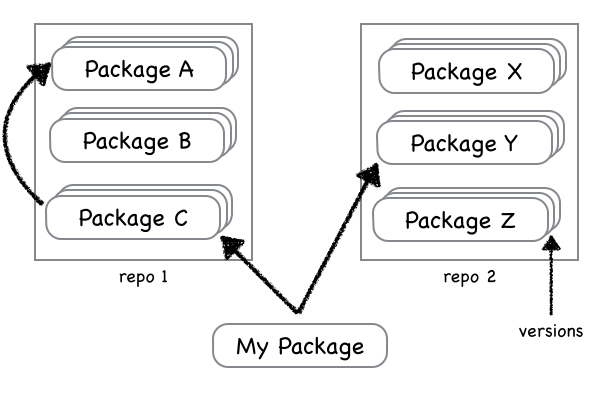

# cdist - C/C++ dependency manager

C/C++ does not have standardised and efficient dependency manager like python-pip, ruby's gems, rust's cargo. There are only build systems like gnu autotools/make, scons, cmake and others.

Recent [biicode](https://www.biicode.com) project tries to solve this problem and provide modern solution for dependency management, but requires for all projects to use biicode. In terms of software systems it's highly intrusive, you can not use third-party written in old 80-th or 90-th project without changing it and adopting to biicode format, which leaves a lot of already written code out of the boat - the main power of c/c++ in 21th century. There are another drawbacks of biicode which prevent it from becoming widely-used tools like

- keeping code itself in biicode repositories, which duplicates VCS (git, svn, mercurial)
- not having prebuilt binaries for widely-used configurations/platforms like [homebrew](http://brew.sh) does.
- single repository stops private companies to use biicode *for* it's projects because of  trust questions.

cdist tries to solve outlined problems and combine the best of popular package/dependency managers and homebrew to build solid platform for painless development of c/c++ projects.

# Key Concepts

- Does not rely on particular build system, rather provide interface for different build systems and ready patterns for popular build systems like make, cmake, scons.
- Use version control systems as a source of sourcecode wherever possible with handling of branches and tags.
- Use decentralised infrastructure where it is possible to setup your own cdist repo and allow projects to mix dependencies from different cdist repos.
- Provide package versioning so it is possible to depend on specific version of a library.
- Use wherever possible prebuilt library binaries to avoid complex build and waste of time like homebrew bottles. Make it optional so you can always force to build dependencies from source.
- Make every build reproducible, so each time i rebuild my project i got the same dependencies even if world changes. To update libraries to newer versions you need to change dependencies list.

# Design

Every project in cdist called package: executable or library. Packages constitute registries and can be duplicated across registires like forks in VCS. Registry is a unit of decentralisation, i.e. every company can setup it's own registry and hold private code there (actually hold links to private code there).



Registries are hosted using git and holds information about package description: metainformation like

- package name
- dependencies
- options
- build instrcutions

This will lead to easy setup of own regstry (simply setup or fork git repo) without complex infrastructiure and third-party server tools and convinient and flexible offline work of cdist.

Registry structure is borrowed from Rust's [Cargo registry index format](https://github.com/rust-lang/cargo/blob/master/src/cargo/sources/registry.rs):

- it has three level folder hierarchy to reduce FS listing costs
- every package is described by one file in json format
- each line in this file describes specific version of package

## Package Description

Here brief overview of package description file which can be in two formats: YAML on client and JSON in registry. Package descrioption file in YAML format is stored in VCS repo along with sources for newly created packages or separeted from source base for adopted projects and is used for making a record in registry. In this case YAML 1-to-1 converted to JSON and create/append package file in registry.

```yaml
id: MyPackage
version: 0.0.1
source: git://example.com/group/repo.git
deps:
	- repo1/packageC@1.2
	- repo2/packageY@3.8
options:
	A:
		flags: --with-a
		env:
			- A_VALUE1=42
			- A_VALUE2=8
		deps:
			- adep
		conflict: B
	B:
		flags: --with-b
		env:
			- B_DEFAULT_DIR='.bdir'
		deps:
			- bdep
		conflict: A
build:
	- ./configure $FLAGS --prefix $DESTDIR
	- make
	- make install
export:
	include_dir: $DESTDIR/include
	library_dir: $DESTDIR/lib
	library: mylib
	defines:
```

Project defines source repo/archive, defines it's dependencies, options and build rules.

Options is a way of defining different static configuration of a package. Option is definig by a set of flags, environment variables and option specific dependencies. During build or defining dependency (see below) it is possible to define option's list. During parsing special variable `$FLAGS` is built based on global configuration and options used.

Build phase is last and make binary library according to the rules in build section. A special variable `$DESTDIR` is a path where it build rules should finally store include files and binary files in `include/` and `lib/` subfolders respectively or something isomorphic.

Package exports unsing `export` section it's include, library dirs and built libraries and defines that is used by headers. Some reasonoble defaults will be added, say to omit exports in case of standard folders naming like `include`, `lib`. Also there will be work on support of packages exporting several libraries, like gtest.

For known build systems build section is replaced with

```yaml
build_system: cmake
```

So only one of `build` and `build_system` section is present in package description.

### Dependency format

Dependency can be written in short or long form. Short oneline has format `[<repo>/]<package>[@<version>]`. Long form syntax is:

```yaml
id: repo1/package
version: 0.1.2
options:
	- option-a
	- option-b
	- ...
```

Everywhere repo identifier can be omited, this means default repo is used.

## Usage process

cdist is just dependency manager. It does not supposed to be a build system at all, instead it just deliver dependencies and make them discoverable and queriable like pkg-config does.

Dependencies are described in package description file (cdist.yaml).

When cdist is invoked to satisfy dependecies requirements in provided dep file following actions is performed

- clone registries to local FS if it first usage of cdist on this machine
- optionaly update (pull) registry from remote
- parse cdist.yaml and prepare transitive list of dependencies using local copy of registry
- if some dependencies are not in cache then
  - download/clone/checkout sources from package description to local cache
  - perform bottom-to-top build of missing dependencies
  - build artifacts like includes and libs are placed within unique package-version specific folder
- provide interface similar to pkg-config to all dependencies build artifacts (include folders/lib folders/lib names)

## Example

Suppose we have project **bar** with dependency from **libfoo**, see [example 1 sources](/examples/1)

### foo

Foo use make as build system. We wrote cdist.yaml file so, that make installs library to project specific folder (chosen by cdist and absolute opaque to user) without any modification of original Makefile. For every widely used build system like make, cmake etc it is possible provided keeping good practices of this build systems and avoiding hardcoded paths.

In this case we did it using make `DESTDIR`/`PREFIX` variables and setting them to cdist.yaml special variable `$DESTDIR` which is bound to user opaque package specific folder chosen by cdist.

After building foo and installing foo into cdist internal folder (`$DESTDIR`) cdist.yaml exports include, library dirs and library name which will be using in building foo users like bar.

### bar

Bar uses cmake build system and looks for foo lib in standard folders with help of `find_package` cmake routine. When we build bar we add foo's libraries to search paths of cmake and thoose resolve dependency.

We add a few parameters to cmake in foo's cdist.yaml file to extend search path by include and library dirs of all bar's dependnecies. This is done through special variables `$INCLUDE_DIRS` and `$LIB_DIRS`.

As this is a binary and there is no need to add this project to cdist registry we do not care about installing in correct folder and exporting correct values.

```bash
cmake .. -DCMAKE_SYSTEM_LIBRARY_PATH=$INCLUDE_DIRS -DCMAKE_SYSTEM_INCLUDE_PATH=$LIB_DIRS
```

### usage

Assume we have just installed cdist on our machine and wrote bar's sources as in example/1.

then we want to build bar and simply type `cdist build` in root of the bar. The following will happen:

- cdist clone and/or update local copy of registry (optional)
- cdist parse cdist.yaml
- resolve dependencies and found just one: foo
- download foo's sources (in future support precompiled binaries for popular package - analog of homebrew bottles will be added)
- build foo and export build artefacts to dedicated folder, say `~/.cdist/builds/foo/0.0.1/`
- build bar with `$INCLUDE_DIRS=~/.cdist/builds/foo/0.0.1/include` and `$LIB_DIRS=~/.cdist/builds/foo/0.0.1/lib`
- everybody happy!

# Open problems

- inherit defines and flags from dependencies. Say library A is build with define `FOO`, we should also define `FOO` in dependant project to avoid potential divergency in preprocessed header files and built library binaries.
- using several versions of the same library. Simple solution is to reject such things.
- defining shared or static library
- non orthogonal options: leave problems up to user or try to handle it?
- is options syntax enough for all build systems?
- what about compiler specific flags, how to handle it?
- release and debug versions? The most simple solution is to have to build sections except for known build systems like cmake and conf.

